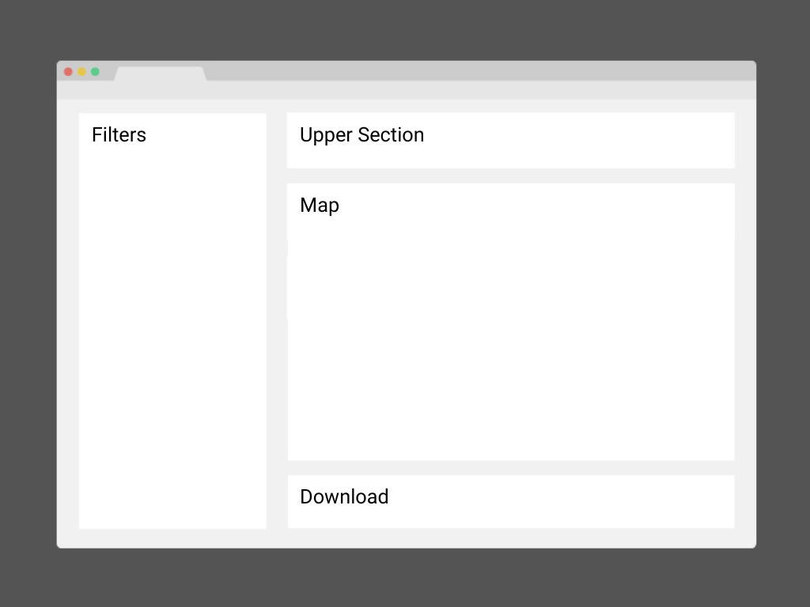

# altimetria_plantec

<!-- Improved compatibility of back to top link: See: https://github.com/othneildrew/Best-README-Template/pull/73 -->
<a name="readme-top"></a>

<!-- PROJECT LOGO -->
<br />
<div align="center">


  </a>

  <p align="center">
    This microservice, developed with Streamlit in Python, generates visualizations of the altimetric profile of a farm using the NASA SRTM Digital Elevation Model. It creates interpolated altimetry maps for all fields and operates on the backend with Google Earth Engine. <br />
    <br />
    <a href="https://geoagro1.atlassian.net/servicedesk/customer/portal/5">Report Bug</a>
    ·
    <a href="https://geoagro1.atlassian.net/servicedesk/customer/portal/5">Request Feature</a>
    <br />
  </p>
</div>


<!-- TABLE OF CONTENTS -->
<details>
  <summary>Table of Contents</summary>
  <ol>
    <li>
      <a href="#about-the-project">About The Project</a>
      <ul>
        <li><a href="#arquitechture-diagram">Arquitechture-Diagram</a></li>
        <li><a href="#built-with">Built With</a></li>
      </ul>
    </li>
    <li>
      <a href="#getting-started">Getting Started</a>
      <ul>
        <li><a href="#installation">Installation</a></li>
        <li><a href="#usage">Usage</a></li>
      </ul>
    </li>
    <li><a href="#Roadmap-and-Related-documentation">Roadmap and Related documentation</a></li>
    <li><a href="#contact">Contact</a></li>
  </ol>
</details>


<!-- ABOUT THE PROJECT -->

## About the project


This microservice, developed with Streamlit in Python, generates visualizations of the altimetric profile of a farm using the NASA SRTM Digital Elevation Model. It creates interpolated altimetry maps for all fields and operates on the backend with Google Earth Engine.



### 1. Filters (Sidebar):
Users can filter data according to Domain, Area, Workspace, Season and Farm.

### 2. Upper Section:
This section features the Domain logo, the dashboard title, a language selector, and user information. It also includes the 'Interval between contour lines (m)' selector.

### 3. Map:
Situated beneath the Upper Section, this area showcases the Fields, Digital Elevation Model (DEM), and an experimental preview of the contour lines.

### 4. Download:
This section contains a button that triggers the generation of interpolated maps from the DEM, a status bar that appears upon clicking the aforementioned button, and a download button that becomes visible upon the completion of the preceding process.

<p align="right">(<a href="#readme-top">back to top</a>)</p>

</details>

## Arquitechture Diagram 

[![arquitectura][arquitectura]](assets/arquitectura.png)

### Description

   
1. The user must login in 360.geoagro.com.

2. In the switcher (up-right corner) must select "___________".

3. It opens the url with two tokens, token1 has an info of user like:
   
     user_info={'email': user_email, 'language': 'es', 'env': 'prod', 'domainId': None, 'areaId': None,   'workspaceId': None, 'seasonId': None, 'farmId': None}

4. An Application Load Balancer take the request and send to fargate.
  
5. In fargate, the dashboard is running troughby docker as service.
   


<p align="right">(<a href="#readme-top">back to top</a>)</p>

### Built With
* [![Python][Python.org]][Python-url]
* [![Docker][docker]][docker-url]
* [![Streamlit][streamlit]][streamlit-url]
* [![Plotly][plotly]][plotly-url]
* [![Pandas][pandas]][pandas-url]
* [![GeoPandas][geopandas]][geopandas-url]
* [![Google Earth Engine][gee]][gee-url]
* [![Folium][folium]][folium-url]

<p align="right">(<a href="#readme-top">back to top</a>)</p>

<!-- GETTING STARTED -->
## Getting Started

To get a local copy up and running follow these simple example steps.

### Installation

1. Clone the repo
   ```sh
   git clone https://github.com/GeoagrobyTEK/ms-altimetry-interpolation.git
   ```
2. Install dependencies
   ```sh
     pip3 install -r requirements.txt
   ```
3. Execute
   ```sh
     streamlit python3 app.py 
   ```

<p align="right">(<a href="#readme-top">back to top</a>)</p>


### Usage

* Uncomment lines 737 to 740 and Comment lines 743 to 787 from app.py

In this way, the app runs with info presetted in user_info (Please, use your email).

Run:
 ```sh
    http://localhost:5000/
 ```

<p align="right">(<a href="#readme-top">back to top</a>)</p>

<!-- ROADMAP AND RELATED DOCUMENTATION -->
## Roadmap and Related documentation

<a href="https://geoagro1.atlassian.net/browse/DLL-106">
  Altimetría e Interpolaciones
</a>

<p align="right">(<a href="#readme-top">back to top</a>)</p>

<!-- CONTACT -->
## Contact

### Mariano Bonelli

[](mailto:mbonelli@geoagro.com?subject=[GitHub]tablero_lotes_cultivos)
[](https://www.linkedin.com/in/mariano-francisco-bonelli/)
[](https://twitter.com/marianobonelli)


### Adrian Cuello (API)

[](mailto:acuello@geoagro.com?subject=[GitHub]tablero_lotes_cultivos)

<p align="right">(<a href="#readme-top">back to top</a>)</p>


<!-- MARKDOWN LINKS & IMAGES -->
<!-- https://www.markdownguide.org/basic-syntax/#reference-style-links -->
[product-screenshot]: assets/Tablero.png

[arquitectura]: assets/arquitectura.png

[Python.org]: https://img.shields.io/badge/Python-3670A0?style=for-the-badge&logo=python&logoColor=ffdd54
[Python-url]: https://python.org/

[streamlit]: https://img.shields.io/badge/Streamlit-FF4B4B?style=for-the-badge&logo=streamlit&logoColor=white
[streamlit-url]: https://docs.streamlit.io/

[docker]: https://img.shields.io/badge/Docker-2496ED?style=for-the-badge&logo=docker&logoColor=white
[docker-url]: https://www.docker.com/

[plotly]: https://img.shields.io/badge/Plotly-3F4F75?style=for-the-badge&logo=plotly&logoColor=white
[plotly-url]: https://plotly.com/python/

[pandas]: https://img.shields.io/badge/Pandas-150458?style=for-the-badge&logo=pandas&logoColor=white
[pandas-url]: https://pandas.pydata.org/

[geopandas]: https://img.shields.io/badge/GeoPandas-119DFF?style=for-the-badge&logo=geopandas&logoColor=white
[geopandas-url]: https://geopandas.org/

[folium]: https://img.shields.io/badge/Folium-77B829?style=for-the-badge&logo=folium&logoColor=white
[folium-url]: https://python-visualization.github.io/folium/

[gee]: https://img.shields.io/badge/Google%20Earth%20Engine-4285F4?style=for-the-badge&logo=google-earth&logoColor=white
[gee-url]: https://earthengine.google.com/